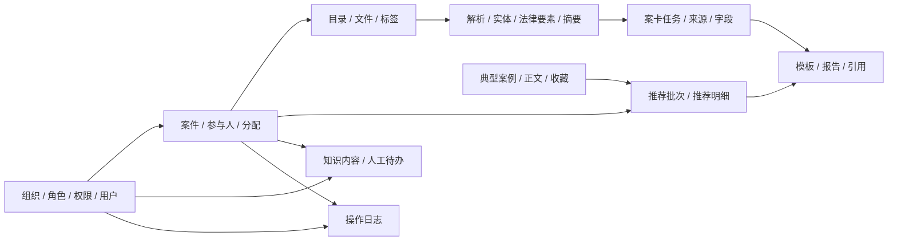

# LexPro 最终 ER 图绘制指南

> 适用结构：V1 + V2 + V3 最终数据库
>
> 最终规模：32 张业务表，全部位于 `lexpro` schema
>
> 物理结构依据：已建立的 PostgreSQL 数据库、`lexpro_schema_upgrade_v2_core.sql`、`lexpro_schema_upgrade_v3_workspace.sql`

## 1. 推荐软件

推荐使用 **DBeaver Community**。

选择它的原因：

- 免费，支持 Windows 和 PostgreSQL。
- 可以直接连接现有数据库，根据真实主键、外键自动生成 ER 图。
- 表和关系发生变化后可以重新生成，不需要手工维护每一条连线。
- 支持自动布局、手工拖动和导出 PNG/SVG。
- 相比在 diagrams.net 中手工画 32 张表，更不容易漏表、写错字段或连错外键。

如果目标是论文或汇报中的精美排版，建议仍先用 DBeaver 生成准确底图并导出 SVG，再做视觉排版；数据库关系的权威来源始终应是 PostgreSQL，而不是图片。

## 2. 从 PostgreSQL 自动生成 ER 图

1. 安装并打开 DBeaver Community。
2. 选择“新建数据库连接”，数据库类型选择 PostgreSQL。
3. 填写主机、端口、数据库名、用户名和密码并测试连接。
4. 展开连接中的 `Databases -> 目标数据库 -> Schemas -> lexpro -> Tables`。
5. 选中 `lexpro` 下全部 32 张表，右键选择 `View Diagram`（查看关系图）。
6. 使用自动布局作为初始结果，然后按本文第 6 节的分区手工调整位置。
7. 总览图关闭或减少普通字段展示，只保留表名、PK 和 FK；分区图再展示完整字段。
8. 导出时优先选择 SVG，汇报需要位图时再导出 2 倍或更高分辨率 PNG。

生成后先执行以下 SQL 核对表数量：

```sql
SELECT count(*) AS table_count
FROM information_schema.tables
WHERE table_schema = 'lexpro'
  AND table_type = 'BASE TABLE';
```

在没有额外自建表时，结果应为 `32`。

## 3. 图例和基数标记

建议在图中统一使用以下标记：

| 标记 | 含义 |
|---|---|
| `PK` | 主键 |
| `FK` | 外键 |
| `UK` | 唯一约束 |
| `1:N` | 一个父记录对应多个子记录 |
| `1:1` | 一个父记录最多对应一个扩展记录 |
| `N:M` | 多对多，必须通过中间表实现 |
| `0..1` | 可选引用，外键允许为空 |
| `XOR` | 多个可选外键中必须且只能填写一个 |

注意：V2 为防止跨案件错误引用，在部分子表中保留了 `case_id`，并使用组合外键校验。这是案件边界约束，不代表数据库中出现了第二种业务关系。

## 4. 最终 32 张表

### 4.1 组织、用户和权限（5 张）

| 表名 | 中文名称 | 主键 | 主要外键 |
|---|---|---|---|
| `organization_unit` | 组织机构 | `organization_id` | `parent_organization_id -> organization_unit`；`leader_user_id -> app_user` |
| `auth_role` | 系统角色 | `role_id` | 无 |
| `auth_permission` | 权限项 | `permission_id` | 无 |
| `auth_role_permission` | 角色权限关系 | `(role_id, permission_id)` | `role_id -> auth_role`；`permission_id -> auth_permission` |
| `app_user` | 用户 | `user_id` | `organization_id -> organization_unit`；`role_id -> auth_role` |

### 4.2 案件核心（4 张）

| 表名 | 中文名称 | 主键 | 主要外键 |
|---|---|---|---|
| `case_record` | 案件 | `case_id` | `creator_id -> app_user` |
| `case_party` | 案件参与人 | `party_id` | `case_id -> case_record` |
| `case_assignment` | 案件人员分配/共享 | `assignment_id` | `case_id -> case_record`；`user_id -> app_user`；`assigned_by -> app_user` |
| `operation_log` | 操作日志 | `log_id` | `user_id -> app_user`；`case_id -> case_record` |

### 4.3 卷宗和解析（6 张）

| 表名 | 中文名称 | 主键 | 主要外键 |
|---|---|---|---|
| `dossier_folder` | 卷宗目录 | `folder_id` | `case_id -> case_record`；`parent_folder_id -> dossier_folder`；`created_by -> app_user` |
| `evidence_file` | 电子卷宗文件 | `dossier_id` | `case_id -> case_record`；`folder_id -> dossier_folder`；`upload_user_id/deleted_by -> app_user` |
| `file_tag` | 文件标签 | `tag_id` | `case_id -> case_record`；`created_by -> app_user` |
| `evidence_file_tag` | 文件标签关系 | `(dossier_id, tag_id)` | `dossier_id -> evidence_file`；`tag_id -> file_tag`；`created_by -> app_user` |
| `document_parse_result` | 文档解析结果 | `doc_id` | `(dossier_id, case_id) -> evidence_file`；`requested_by -> app_user` |
| `entity_result` | 实体识别结果 | `entity_result_id` | `(doc_id, case_id) -> document_parse_result`；`created_by/confirmed_by -> app_user` |

### 4.4 法律分析、摘要和案卡（5 张）

| 表名 | 中文名称 | 主键 | 主要外键 |
|---|---|---|---|
| `legal_element_result` | 法律要素识别结果 | `element_result_id` | `(doc_id, case_id) -> document_parse_result`；`created_by/confirmed_by -> app_user` |
| `case_summary` | 案件摘要 | `summary_id` | `case_id -> case_record`；`created_by/confirmed_by -> app_user` |
| `case_card_fill_task` | 案卡回填任务 | `fill_task_id` | `case_id -> case_record`；`operator_id/confirmed_by -> app_user` |
| `case_card_task_source` | 案卡任务来源 | `source_id` | `(fill_task_id, case_id) -> case_card_fill_task`；四类来源外键 XOR |
| `case_card_field` | 案卡字段明细 | `field_id` | `fill_task_id -> case_card_fill_task`；`source_file_id -> evidence_file`；`confirmed_by -> app_user` |

`case_card_task_source` 的四类可选来源是：

- `(doc_id, case_id) -> document_parse_result`
- `(entity_result_id, case_id) -> entity_result`
- `(element_result_id, case_id) -> legal_element_result`
- `(summary_id, case_id) -> case_summary`

每条来源记录必须且只能选择其中一种。

### 4.5 报告（5 张）

| 表名 | 中文名称 | 主键 | 主要外键 |
|---|---|---|---|
| `report_template` | 报告模板 | `template_id` | `created_by -> app_user` |
| `case_report` | 案件审查报告 | `report_id` | `case_id -> case_record`；`template_id -> report_template`；`(card_fill_task_id, case_id) -> case_card_fill_task`；多个用户审计外键 |
| `report_evidence` | 报告引用卷宗 | `(report_id, dossier_id)` | `(report_id, case_id) -> case_report`；`(dossier_id, case_id) -> evidence_file` |
| `report_legal_element_result` | 报告引用法律要素 | `(report_id, element_result_id)` | `(report_id, case_id) -> case_report`；`(element_result_id, case_id) -> legal_element_result` |
| `report_typical_case_reference` | 报告引用典型案例 | `(report_id, typical_case_id)` | `(report_id, case_id) -> case_report`；`typical_case_id -> typical_case`；推荐明细组合外键；`cited_by -> app_user` |

`case_report` 中与用户相关的外键包括 `operator_id`、`created_by` 和 `finalized_by`。

### 4.6 典型案例和推荐（5 张）

| 表名 | 中文名称 | 主键 | 主要外键 |
|---|---|---|---|
| `typical_case` | 典型案例元数据 | `typical_case_id` | 无 |
| `typical_case_content` | 典型案例正文 | `typical_case_id` | PK 同时 FK -> `typical_case` |
| `case_recommendation` | 案件推荐批次 | `recommend_id` | `case_id -> case_record`；`(source_summary_id, case_id) -> case_summary`；`created_by -> app_user` |
| `case_recommendation_item` | 推荐结果明细 | `item_id` | `(recommend_id, case_id) -> case_recommendation`；`typical_case_id -> typical_case` |
| `typical_case_favorite` | 典型案例收藏 | `(user_id, typical_case_id)` | `user_id -> app_user`；`typical_case_id -> typical_case` |

### 4.7 内容和待办（2 张）

| 表名 | 中文名称 | 主键 | 主要外键 |
|---|---|---|---|
| `knowledge_content` | 知识/规则/清单 | `content_id` | `owner_organization_id -> organization_unit`；`created_by/reviewed_by/published_by -> app_user` |
| `work_task` | 人工待办任务 | `task_id` | `case_id -> case_record` 或 `content_id -> knowledge_content`；`assignee_id/created_by -> app_user` |

`work_task.case_id` 与 `work_task.content_id` 是 XOR 关系：一条任务必须关联案件或知识内容中的一个，不能同时关联，也不能都为空。

## 5. 核心关系基数

以下是绘图时需要明确标注的业务基数。用户审计字段产生的普通 `app_user 1:N` 关系可由 DBeaver 自动显示，不必在总览图上逐条写中文标签。

| 父表 | 子表/关系表 | 基数 | 说明 |
|---|---|---:|---|
| `organization_unit` | `organization_unit` | 1:N | 组织树，自关联 |
| `organization_unit` | `app_user` | 1:N | 用户只有一个主要组织，组织可有多个用户 |
| `auth_role` | `app_user` | 1:N | 用户只有一个系统角色 |
| `auth_role` | `auth_permission` | N:M | 通过 `auth_role_permission` |
| `case_record` | `case_party` | 1:N | 一个案件有多个参与人 |
| `case_record` | `case_assignment` | 1:N | 承办、复核和协作历史 |
| `case_record` | `dossier_folder` | 1:N | 一个案件有多级目录 |
| `dossier_folder` | `dossier_folder` | 1:N | 目录树，自关联 |
| `case_record` | `evidence_file` | 1:N | 一个案件有多个卷宗文件 |
| `dossier_folder` | `evidence_file` | 1:N | 文件可选择一个目录 |
| `evidence_file` | `file_tag` | N:M | 通过 `evidence_file_tag`，标签受案件范围限制 |
| `evidence_file` | `document_parse_result` | 1:N | 一个文件支持多次解析 |
| `document_parse_result` | `entity_result` | 1:N | 同一解析版本可有多次实体识别 |
| `document_parse_result` | `legal_element_result` | 1:N | 同一解析版本可有多次法律要素识别 |
| `case_record` | `case_summary` | 1:N | 按摘要类型和版本保存 |
| `case_record` | `case_card_fill_task` | 1:N | 案卡生成/回填历史 |
| `case_card_fill_task` | `case_card_task_source` | 1:N | 一个任务使用多个来源 |
| `case_card_fill_task` | `case_card_field` | 1:N | 一个任务产生多个字段 |
| `report_template` | `case_report` | 1:N | 报告可以不使用模板 |
| `case_record` | `case_report` | 1:N | 按类型和版本保存报告 |
| `case_report` | `evidence_file` | N:M | 通过 `report_evidence` |
| `case_report` | `legal_element_result` | N:M | 通过 `report_legal_element_result` |
| `typical_case` | `typical_case_content` | 1:0..1 | 元数据可有一份正文扩展记录 |
| `case_record` | `case_recommendation` | 1:N | 一个案件可执行多次推荐 |
| `case_recommendation` | `case_recommendation_item` | 1:N | 一个推荐批次有多个排名结果 |
| `typical_case` | `case_recommendation_item` | 1:N | 典型案例可出现在多个推荐批次中 |
| `app_user` | `typical_case` | N:M | 收藏关系通过 `typical_case_favorite` |
| `case_report` | `typical_case` | N:M | 引用关系通过 `report_typical_case_reference` |
| `organization_unit` | `knowledge_content` | 1:N | 内容可归属一个组织 |
| `case_record`/`knowledge_content` | `work_task` | 1:N | 每条任务二选一关联业务对象 |

## 6. 推荐的画布布局

### 6.1 总览图

总览图只展示表名、PK、FK 和基数，按从左到右的业务流放置：

```text
[组织/权限/用户]
        |
        v
[案件核心] -> [卷宗/解析] -> [智能结果/案卡] -> [报告]
     |                                              |
     +----------------> [典型案例推荐] <-------------+
     |
     +----------------> [知识内容/待办/审计]
```

建议位置：

| 画布区域 | 放置表 |
|---|---|
| 左上 | `organization_unit`、`auth_role`、`auth_permission`、`auth_role_permission`、`app_user` |
| 左中 | `case_record`、`case_party`、`case_assignment` |
| 中部 | `dossier_folder`、`evidence_file`、`file_tag`、`evidence_file_tag`、`document_parse_result` |
| 中下 | `entity_result`、`legal_element_result`、`case_summary` |
| 右中 | `case_card_fill_task`、`case_card_task_source`、`case_card_field` |
| 右上 | `report_template`、`case_report`、三个报告引用关系表 |
| 右下 | `typical_case`、`typical_case_content`、`case_recommendation`、`case_recommendation_item`、`typical_case_favorite` |
| 底部 | `knowledge_content`、`work_task`、`operation_log` |

### 6.2 分区图

字段完整的图建议拆为以下 5 张：

1. 用户、组织、RBAC 与案件授权。
2. 案件、参与人、卷宗目录、文件和标签。
3. 文档解析、智能结果、摘要和案卡。
4. 报告、引用关系、典型案例和推荐。
5. 知识内容、人工待办和操作日志。

公共表可以在不同分区图中重复出现，例如 `app_user` 和 `case_record`，但应标注为“引用表”，不要误认为数据库中存在重复表。

## 7. 总览图可使用的 Mermaid 草图

这段代码用于快速检查主业务链路，不替代 PostgreSQL 反向生成的物理 ER 图。可在支持 Mermaid 的 Markdown 编辑器中预览。



## 8. 与旧 ER 图相比必须修改的内容

绘制新图时不要继续保留旧图中的以下结构：

- `app_user.role`、`permissions_json`、`case_scope` 已删除，改为 `role_id`、`organization_id` 和 RBAC 表。
- `case_record.prosecutor_id` 已删除，承办、复核、协作统一进入 `case_assignment`。
- `case_record.deadline_date` 已删除，使用 `deadline_at`。
- `case_party.age` 已删除，使用 `birth_date`。
- `evidence_file.parse_status` 已删除，解析状态和历史保存在 `document_parse_result`。
- `case_assignment.is_current` 已删除，以 `ended_at IS NULL` 表示当前有效分配。
- `case_record` 与 `typical_case` 没有 1:1 关系；二者通过推荐批次和推荐明细关联。
- 旧的单表推荐结果应拆为 `case_recommendation` 和 `case_recommendation_item`。
- 报告引用多个文件时使用 `report_evidence`，不能再使用 `dossier_ids_json` 作为关系。
- 案卡字段表只有一个 `case_card_field`，不要重复绘制。
- 案卡来源使用 `case_card_task_source` 的真实外键，不使用模糊的 `source_result_id`。
- 报告与典型案例引用通过 `report_typical_case_reference`，收藏通过 `typical_case_favorite`。

## 9. 绘图验收清单

- [ ] 图中恰好包含 32 张不同的表。
- [ ] 组织树和卷宗目录树的自关联已绘制。
- [ ] `auth_role_permission`、`evidence_file_tag`、报告引用表和收藏表按关系表绘制。
- [ ] `typical_case_content` 与 `typical_case` 标为 1:0..1，而不是案件与典型案例 1:1。
- [ ] 文件到解析结果标为 1:N，而不是 1:1。
- [ ] 案件到报告标为 1:N，并体现报告版本。
- [ ] `case_card_task_source` 的四选一来源关系有 XOR 说明。
- [ ] `work_task` 的案件/知识内容二选一关系有 XOR 说明。
- [ ] 组合外键中的 `case_id` 已保留，且没有被误解成重复业务关系。
- [ ] 已删除字段没有出现在新图中。
- [ ] 总览图文字可读，字段完整信息放在分区图中。

## 10. 当前文件状态提醒

当前工作区中的 `lexpro_schema_postgresql.sql` 只有 pgvector 和表数量验证查询，不再包含原 V1 的 21 张表建表语句。已经建好的数据库不受影响，DBeaver 应直接从实际数据库读取最终结构；但在需要重新建库或交付部署前，必须恢复或重新导出一份完整的 V1/最终建库脚本。
