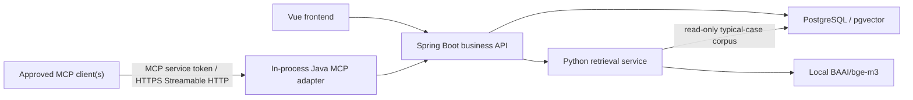

# LexPro AI Retrieval and MCP Architecture

[中文版本](zh-CN/AI_RETRIEVAL_AND_MCP_ARCHITECTURE.md)

> Status: M7 retrieval and the external AI MCP core implementation are complete; HTTPS deployment and named-client acceptance remain open.

## Goals

- Implement typical-case retrieval with the Python retrieval/AI ecosystem.
- Keep Spring Boot as the authoritative business and security boundary.
- Integrate one controlled MCP Server without creating another source of business truth.
- Reuse the final V1/V2/V3 database instead of adding speculative tables.

## Logical architecture

M7 uses a restricted read-only PostgreSQL account for Python. That account can read only
`lexpro.typical_case` and `lexpro.typical_case_content`; Java remains the only writer and sends
only the already-authorized query snapshot. Embeddings use local `BAAI/bge-m3`, 1024 dimensions
and cosine distance, so retrieval does not export case text to DeepSeek or another external model.

## Component responsibilities

| Component | Owns | Must not do |
|---|---|---|
| Vue | User workflow and result presentation | Decide authorization or trust client-side filters |
| Spring Boot | Authentication, case visibility, query orchestration, authoritative writes, favorites and audit | Delegate permission decisions to Python or MCP |
| Python retrieval service | Text normalization, structured/full-text/vector recall, fusion, reranking and reason calculation | Create users, change cases, grant access or write authoritative audit/history records |
| PostgreSQL | Final business schema, typical-case corpus, vectors after model approval, recommendation history | Fix vector dimensions before the model decision |
| MCP Server | Adapt allowlisted application capabilities for approved MCP clients | Become a second business API that bypasses Java services or expose arbitrary SQL/filesystem access |

## Typical-case retrieval flow

1. The authenticated user starts retrieval for a case through Java.
2. Java verifies case-level access and builds the minimum authorized query snapshot.
3. Java calls Python through a versioned internal contract with a request ID and timeout.
4. Python performs structured filtering, full-text/vector recall, fusion and reranking, and returns bounded candidates, scores, reasons and model/index parameters.
5. Java validates the response, writes `case_recommendation` and `case_recommendation_item`, and records the operation in `operation_log`.
6. Java returns an authorized response DTO. Favorites remain Java-owned writes to `typical_case_favorite`.

The internal contract must define schema version, request ID, authorized scope, query snapshot, filters, maximum result count, model/index identifiers, ranked scores, reason structure, timeout and error codes. Retries must be bounded and must not duplicate recommendation records.

## MCP Server boundary

The project exposes exactly one logical MCP Server in the Spring Boot process. The target deployment uses the official Java MCP SDK and stateless Streamable HTTP at `/mcp`, protected by a dedicated MCP service token on every request. External projects do not simulate an interactive LexPro login and do not reuse the web-user JWT. The endpoint remains disabled by default with `LEXPRO_MCP_ENABLED=false`.

The MCP security chain now accepts only registered service tokens and resolves them to `clientId` plus scoped authorities. The normal application APIs continue to use web-user JWTs.

Initial MCP rules:

- Use an explicit tool/resource allowlist; never expose generic SQL, shell, filesystem or unrestricted HTTP tools.
- Prefer read-only tools for the first release.
- Define strict JSON Schema inputs, result-size limits, timeouts and stable error responses.
- Resolve each valid service token to a bounded `clientId` and authority set. The current text-processing tools do not impersonate an application user; future case-bound tools require a separately approved service-account or delegated-user design.
- Filter sensitive fields before returning content.
- Write security-sensitive calls and every approved mutation to `operation_log` with the request ID.
- Treat tool descriptions, retrieved documents and user text as untrusted input; they cannot override authorization or tool policies.

The approved replacement tool catalog is:

- `lexpro_recognize_legal_elements`
- `lexpro_recognize_entities`
- `lexpro_summarize_case`
- `lexpro_push_typical_cases` (read-only partner typical-case recommendation; no recommendation history is written)

No MCP resources, prompts, generic database access, filesystem access or mutating tools are exposed. The first three tools call the existing validated DeepSeek-compatible clients. The typical-case tool accepts a supplied fact snapshot and bounded partner filters, then reuses the Java partner recommendation client for its analyze/search pipeline. It returns allowlisted ranked case metadata and short content excerpts, while omitting provider analysis IDs, retrieval IDs, internal table names and full case content. It does not write `case_recommendation` history because MCP service tokens do not impersonate a web user or bypass case-level authorization.

The typical-case MCP tool is available only when the deployment explicitly enables retrieval, selects `PARTNER` as the provider, and permits partner case-data transfer. It returns a stable unavailable/disabled error when those prerequisites are not met. The original tool name is retained for client compatibility; its behavior is now recommendation rather than mutation or push.

Real case text is approved for transfer to DeepSeek through the first three tools when the deployment explicitly sets `LEXPRO_AI_ALLOW_EXTERNAL_CASE_DATA=true`. This approval does not relax client authorization, least-data, audit, response-bounding or log-redaction controls, and it does not apply to any other external provider.

## Delivery order

1. Complete the normal Java case and dossier service boundaries before exposing them through MCP.
2. During M7, approve the embedding model and retrieval contract, then implement and evaluate the Python service.
3. During the M8 redesign, implement dedicated service-token authentication, the four-tool AI catalog, bounded concurrency and the HTTPS deployment boundary, then accept it against the named client.
4. Add mutating tools only as separate requirements after authorization and audit behavior are proven.

## Open decisions

- Which named MCP client(s) will be used for final acceptance?
- Which existing reverse proxy or gateway will terminate TLS, and which source networks or client egress IPs will be allowlisted?
- Which additional masking/data-classification rules are required beyond the approved DeepSeek transfer boundary?
- What client IDs, permissions, quotas and token lifetimes are approved for the first external integrations?
