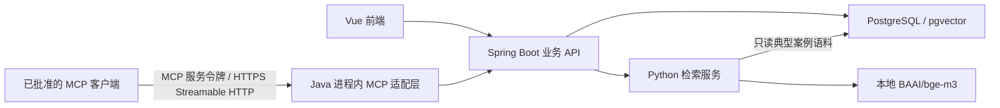

# LexPro 类案检索与 MCP 架构

[English](../AI_RETRIEVAL_AND_MCP_ARCHITECTURE.md)

> 状态：M7 检索与外部 AI MCP 核心实现已完成；HTTPS 部署和具体客户端验收仍待完成。

## 目标

- 使用 Python 检索和 AI 生态实现类案检索。
- 保持 Spring Boot 为权威业务边界和安全边界。
- 集成一个受控 MCP Server，但不产生第二套业务数据权威来源。
- 复用最终 V1/V2/V3 数据库，不提前增加推测性的表。

## 逻辑架构

M7 为 Python 使用受限的 PostgreSQL 只读账号，该账号只能读取
`lexpro.typical_case` 和 `lexpro.typical_case_content`。Java 仍是唯一写入方，且只向 Python
发送已经过案件授权的查询快照。Embedding 使用本地 `BAAI/bge-m3`、1024 维和余弦距离，
不会把案件文本发送给 DeepSeek 或其他外部模型。

## 组件职责

| 组件 | 负责 | 禁止 |
|---|---|---|
| Vue | 用户操作流程和结果展示 | 决定权限或信任前端筛选条件 |
| Spring Boot | 认证、案件可见范围、查询编排、权威写入、收藏和审计 | 把权限决定交给 Python 或 MCP |
| Python 检索服务 | 文本规范化、结构化/全文/向量召回、融合、重排和推荐理由计算 | 创建用户、修改案件、授予访问权限，或写入权威审计/推荐历史 |
| PostgreSQL | 最终业务结构、典型案例语料、模型确认后的向量、推荐历史 | 在模型确定前固定向量维度 |
| MCP Server | 把白名单内的应用能力适配给已批准的 MCP 客户端 | 绕过 Java 服务形成第二套业务 API，或暴露通用 SQL、文件系统访问 |

## 类案检索流程

1. 已登录用户通过 Java 为某个案件发起类案检索。
2. Java 检查案件级权限，并构造最小化的已授权查询快照。
3. Java 使用带版本、请求 ID 和超时的内部协议调用 Python。
4. Python 执行结构化筛选、全文/向量召回、融合和重排，返回数量受限的候选、分数、理由以及模型/索引参数。
5. Java 校验响应，写入 `case_recommendation` 和 `case_recommendation_item`，并在 `operation_log` 中记录操作。
6. Java 返回经过授权的响应 DTO；收藏仍由 Java 写入 `typical_case_favorite`。

内部协议必须定义 Schema 版本、请求 ID、授权范围、查询快照、筛选条件、最大结果数、模型/索引标识、排序分数、理由结构、超时和错误码。重试次数必须有限，而且不能重复创建推荐记录。

## MCP Server 边界

项目只开放一个逻辑 MCP Server，并在 Spring Boot 进程内实现。目标部署使用官方 Java MCP SDK，通过 `/mcp` 提供无状态 Streamable HTTP，每个请求都携带独立的 MCP 服务令牌。外部项目不模拟 LexPro 普通用户登录，也不复用网页登录 JWT。端点默认由 `LEXPRO_MCP_ENABLED=false` 关闭。

MCP 专用安全链现在只接受注册服务令牌，并解析为 `clientId` 和受限权限集合；普通应用 API 继续使用网页登录 JWT。

首期 MCP 规则：

- 使用明确的工具/资源白名单，绝不开放通用 SQL、Shell、文件系统或不受限 HTTP 工具。
- 首个版本优先只提供只读工具。
- 输入使用严格 JSON Schema，并限制结果大小、执行超时和稳定错误响应。
- 将每个有效服务令牌解析为受限的 `clientId` 和权限集合。本轮文本处理工具不冒充应用用户；未来增加案件绑定工具时，必须另行批准服务账号或终端用户委托方案。
- 返回内容前过滤敏感字段。
- 安全敏感调用和每个获批写操作都使用请求 ID 写入 `operation_log`。
- 工具描述、检索文档和用户文本都属于不可信输入，不能覆盖权限或工具策略。

批准替换后的工具目录为：

- `lexpro_recognize_legal_elements`
- `lexpro_recognize_entities`
- `lexpro_summarize_case`
- `lexpro_push_typical_cases`（保留占位，固定返回 `TYPICAL_CASE_PUSH_NOT_IMPLEMENTED`）

首版不开放 MCP Resource、Prompt、通用数据库访问、文件系统访问或写操作工具。前三个工具调用现有经过校验的 DeepSeek-compatible 客户端；典型案例工具在单独获批实现前不访问网络或数据库。

部署时显式设置 `LEXPRO_AI_ALLOW_EXTERNAL_CASE_DATA=true` 后，前三个工具已获准将真实案件文本发送给 DeepSeek。该批准不放宽客户端授权、最小数据范围、审计、响应上限和日志脱敏控制，也不适用于其他外部供应商。

## 交付顺序

1. 先完成普通 Java 案件和卷宗服务边界，再通过 MCP 暴露对应能力。
2. M7 阶段先批准 Embedding 模型和检索协议，再实现并评估 Python 服务。
3. M8 改造阶段实现独立服务令牌认证、四工具 AI 目录、有界并发和 HTTPS 部署边界，再使用指定客户端验收。
4. 只有在权限和审计行为验证完成后，才把写操作作为独立需求逐项增加。

## 待确认决策

- 最终使用哪些具体 MCP 客户端进行验收？
- 由哪个现有反向代理或网关终止 TLS，以及允许哪些来源网段或调用方出口 IP？
- 在已批准的 DeepSeek 外发边界之外，还需要哪些脱敏和数据分类规则？
- 首批外部项目获批的 `clientId`、权限、配额和令牌有效期是什么？
