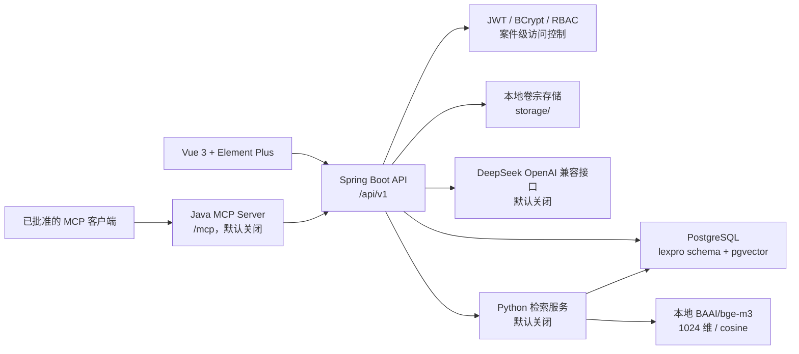

# LexPro 后端现状、功能进度与人工验收说明

> 用途：组会汇报、开发交接和本地人工验收  
> 更新时间：2026-08-10  
> 适用版本：Spring Boot 3.5.16、Java 21、PostgreSQL、Vue 3

## 1. 结论先看

LexPro 当前已经具备一个可运行的后端模块化单体，核心技术链路已经打通：

- Spring Boot 后端可以连接现有 PostgreSQL `lexpro` 数据库，提供健康检查、Swagger/OpenAPI、JWT 登录和业务 API。
- M0-M2 基础工程、认证、用户、组织和权限已完成。
- M3 案件工作流、M4 卷宗管理、M5 文档解析与智能处理、M6 案卡/报告、M7 典型案例检索、M8 MCP Server、M9 工作台接口均已有代码实现。
- 前端已经接入登录、案件、首页工作台、知识内容和待办任务等主要真实 API；智能识别、摘要、报告、组织管理和典型案例页面仍有 Mock 或原型行为。
- 后端自动化测试、后端打包和前端生产构建已经通过；部分功能还需要在当前环境中重复人工验收，不能仅凭 Maven 测试判断已经可以生产部署。

因此，当前更准确的状态是：**核心后端开发完成，前后端部分对接完成，具备开发环境交付和组会演示条件；生产投入仍受数据策略、存储、外部 AI、备份恢复、部署安全和真实 MCP 客户端验收等事项限制。**

## 1.1 白话版：现在到底做到哪一步了

可以把这个项目想成一个“案件办公系统”：

- **前端**就是你在浏览器里看到的页面和按钮。
- **后端**就是接收按钮操作、检查权限、处理业务、保存数据的程序。
- **数据库**就是长期保存案件、人员、文件和任务的地方。
- **Python 检索服务**只负责“从典型案例库里找相似案例”，不是整个后端。
- **MCP Server**是给经过批准的 AI 客户端使用的一扇受控窗口，只能调用规定好的查询功能。

目前的实际情况可以简单概括为：

1. **后端的主体已经写好。** 登录、用户、权限、案件、文件、任务、知识内容、报告和推荐等功能，后端接口大部分已经存在。
2. **前端只接上了一部分接口。** 登录、首页、案件、知识内容和待办任务已经能使用真实数据库；智能识别、摘要、报告、组织管理和典型案例页面还主要是演示页面。
3. **“Mock”就是假数据。** 页面看起来能操作，不代表它真的保存到了数据库。带 Mock 的页面只能用于展示，不能当作真实功能验收。
4. **Swagger 是后端的测试页面。** 打开 `http://127.0.0.1:8080/swagger-ui.html`，可以不经过前端，直接逐个调用后端接口。因此前端还没接好的功能，要先在 Swagger 里测试。
5. **M7 不是普通页面功能。** 它需要额外启动 Python 服务，并使用已经批准的 V4 向量数据库配置；默认关闭是为了避免误用或误发数据。
6. **M8 也不是普通页面功能。** 它是给 MCP 客户端调用的接口，代码已经完成，但还没有选定一个真实 MCP 客户端做最终验收。
7. **现在可以做开发环境演示和交接。** 但还不能直接说“已经可以上线生产”，因为生产服务器、备份恢复、文件存储、真实 AI 数据策略、权限规则等还需要负责人确认和演练。

### 用一次操作来理解数据流

例如你在“待办案件”页面点击“新建案件”：

1. 前端把表单内容发送给后端。
2. 后端先确认你已经登录，并且有创建案件的权限。
3. 后端检查字段是否正确、案件是否允许当前用户操作。
4. 后端把案件保存到 PostgreSQL。
5. 后端返回案件编号和详情，前端再显示出来。
6. 重要操作同时写入审计日志，方便以后追查。

如果页面使用的是 Mock 数据，第 1 步和第 5 步可能只是页面内部变化，不会真正执行第 2 至第 6 步。

### M0-M9 用最简单的话说

| 阶段 | 白话解释 | 当前情况 |
|---|---|---|
| M0 | 把项目、数据库脚本、文档和启动方式整理好 | 已完成 |
| M1 | 规定后端接口怎么报错、分页、记录日志 | 已完成 |
| M2 | 做登录、密码、用户、组织和权限 | 已完成 |
| M3 | 做案件的新增、查询、修改、分案和权限 | 主体已完成，部分规则待确认 |
| M4 | 做卷宗文件的上传、查看、下载、删除和恢复 | 本地开发版已完成 |
| M5 | 从文档中解析文字，并生成实体、法律要素和摘要 | 开发版已完成，生产解析器未定 |
| M6 | 生成案卡和报告，并支持复核、定稿、导出 | 主体已完成，前端未完全接入 |
| M7 | 根据当前案件查找相似典型案例 | Java/Python 已完成，需单独启动和验收 |
| M8 | 让批准的 MCP 客户端查询 LexPro | Server 已完成，真实客户端待验收 |
| M9 | 做首页、知识内容和待办任务工作台 | 前后端主体已接通 |

## 2. 系统总体结构



职责边界如下：

| 组件 | 负责内容 | 不负责内容 |
|---|---|---|
| Vue 前端 | 页面、表单、导航、请求结果展示 | 决定权限、保存权威业务状态 |
| Spring Boot | 认证、授权、业务规则、事务、写库、审计、文件 API | 把权限判断交给前端或 Python |
| PostgreSQL | 业务数据、约束、审计、已确认向量 | 不直接暴露给浏览器或 MCP 客户端 |
| Python 检索服务 | 文本规范化、Embedding、词法/向量召回、RRF 融合和重排 | 创建用户、修改案件、写推荐历史 |
| MCP Server | 将白名单内的只读能力适配给 MCP 客户端 | 通用 SQL、Shell、文件系统和写操作 |

## 3. 代码仓库结构

```text
D:\desktop\soph\lexpro
├─ src/                                  # Vue 3 前端
│  ├─ api/                                # HTTP、认证、案件、工作台 API 封装
│  ├─ auth/                               # Token/session 和权限状态
│  ├─ components/                         # 布局和通用展示组件
│  ├─ views/                              # 路由页面
│  ├─ router/                             # 路由、登录保护、页面权限
│  └─ mock/                               # 尚未完成真实接入的原型数据
├─ backend/lexpro-backend/               # Java Spring Boot 后端
│  ├─ src/main/java/com/lexpro/lexprobackend/
│  │  ├─ auth/                            # 登录、JWT、密码、认证配置
│  │  ├─ user/                            # 用户查询和管理员用户操作
│  │  ├─ organization/                    # 组织树
│  │  ├─ casework/                        # 案件、当事人、分案和访问控制
│  │  ├─ dossier/                         # 卷宗目录、文件和本地存储
│  │  ├─ processing/                      # 解析、实体、法律要素、摘要、AI
│  │  ├─ report/                          # 案卡、报告、模板、导出
│  │  ├─ recommendation/                  # 典型案例导入、推荐、收藏、历史
│  │  ├─ workspace/                       # 知识内容、工作任务、首页统计
│  │  ├─ mcp/                             # MCP Server、工具白名单和输出过滤
│  │  └─ common/                          # 错误、分页、健康检查、审计、Web 配置
│  ├─ src/main/resources/
│  │  ├─ application.properties           # 环境变量映射和默认配置
│  │  └─ db/migration/                    # Flyway V1-V4 资源
│  └─ src/test/java/                      # 按模块组织的聚焦测试
├─ backend/retrieval-service/             # M7 Python FastAPI 检索服务
├─ DBM/                                   # 已审查数据库脚本和 V4 升级 SQL
└─ docs/                                  # 英文权威文档和中文交接文档
```

### 3.1 Java 后端分层

每个业务包按 `Controller -> Service -> Mapper` 组织：

1. `web` 接收请求 DTO、校验输入、返回响应 DTO，不直接返回数据库实体。
2. `service` 执行权限检查、案件可见性检查、业务规则和事务，是业务行为的主要入口。
3. `mapper` 和 domain 对应 MyBatis-Plus/SQL 持久化模型。
4. `common` 提供跨模块能力：`ProblemDetail` 错误、分页、请求 ID、CORS、OpenAPI、审计和健康检查。

关键安全约束：

- 密码只以 BCrypt 哈希保存；响应不包含密码哈希、JWT、内部文件路径或 Embedding。
- 认证使用 Bearer JWT，Access Token 默认有效期 30 分钟，没有 Refresh Token 黑名单。
- 权限在 Spring Security 和 Service 层双重执行；案件接口还会检查当前用户是否能看到目标案件。
- 安全敏感和案件变更操作写入 `operation_log`，请求 ID 用于关联日志和审计。
- API 错误统一使用 `application/problem+json`，包含稳定 `errorCode`、`requestId`，字段校验错误可包含 `fieldErrors`。

## 4. M0-M9 实现进度

状态含义：`已完成` 表示代码和必要的自动化测试已具备；`部分完成` 表示有代码但仍有人工、产品或外部环境门槛；`未完成/阻塞` 表示不能作为生产承诺。

| 模块 | 项目需要的功能 | 后端状态 | 前端状态 | 当前剩余工作 |
|---|---|---|---|---|
| M0 | Git、文档、Flyway、环境配置 | 已完成 | 不适用 | V1/V2/V3 不得重跑；生产迁移需备份和审批 |
| M1 | 统一 API 规范、异常、校验、分页、审计、CORS、OpenAPI | 已完成 | HTTP 封装已使用 | 生产日志、监控和限流策略仍需部署验证 |
| M2 | 登录、JWT、用户、组织、角色、权限 | 已完成 | 登录、会话过期、路由保护已接入 | 需人工准备普通账号完成越权验收 |
| M3 | 案件 CRUD、当事人、分案、案件级权限、期限 | 已完成主体 | 待办案件、列表、详情、创建、更新已接入 | 案件状态流转矩阵、案号生成、身份证号策略需确认 |
| M4 | 卷宗目录、标签、上传、下载、软删除、恢复 | 已完成本地存储版 | 当前主要由 Swagger/接口验收 | MinIO、保留策略、病毒扫描和生产对象存储未定 |
| M5 | 文本解析、实体、法律要素、摘要和 AI 生成 | 已完成开发版 | 三个智能页面仍为 Mock/原型 | PDF/Office/MinerU 生产解析器；DeepSeek 正向流程需批准外发 |
| M6 | 案卡、模板、报告草稿、复核、定稿、DOCX/PDF 导出 | 已完成主体 | 报告页仍为 Mock | 完整人工验证转交流程、字体/Office/PDF 生产策略 |
| M7 | 典型案例导入、混合检索、推荐历史、收藏 | Java + Python 已完成 | `CaseRecommend.vue` 仍为 Mock | 生产库 V4/只读账号、模型版本和真实规模性能需确认 |
| M8 | MCP 只读工具、安全边界、审计 | Java Server 已完成 | 不依赖普通页面 | 选定并验收真实 MCP 客户端；生产网络边界和 TLS |
| M9 | 知识内容、工作任务、首页统计 | 已完成主体 | 已接入真实 API | 状态流转矩阵、删除生命周期、生产部署验证 |

### 4.1 M0-M2：工程基础、认证和权限

已实现：

- Java 21、Spring Boot 3.5.16、Maven、MyBatis-Plus、PostgreSQL、Flyway、SpringDoc。
- `/api/health` 和 `/api/health/database` 健康检查；数据库健康接口排除 Flyway 基础设施表，业务表基线为 32 张。
- 登录、当前用户、退出登录；错误密码、未登录和失效 Token 有受控错误响应。
- 管理员创建用户、禁用/启用用户、重置密码；组织树、角色和权限目录查询。
- 登录限流、BCrypt、CORS、请求 ID、统一错误和审计辅助类。

主要接口：

```text
POST /api/v1/auth/login
GET  /api/v1/auth/me
POST /api/v1/auth/logout
GET  /api/v1/users
POST /api/v1/users
PATCH /api/v1/users/{userId}/status
PUT  /api/v1/users/{userId}/password
GET  /api/v1/organizations/tree
GET  /api/v1/roles
GET  /api/v1/permissions
```

### 4.2 M3：案件工作流

已实现：

- 案件分页、标题/状态等条件查询、创建、详情和普通字段更新。
- 当事人增改查；分案、承办人/审核人/协作者历史；结束当前分案。
- 案件级可见性检查、案件访问级别、期限计算和逾期判断。
- 相关变更写入操作日志；前端首页和待办案件不再依赖原始 Mock。

需要注意：普通更新接口目前不承担案件状态流转。状态转移矩阵、允许转移的角色、最终案号规则和身份证号加密/哈希/精确查询策略仍需业务确认后再增加迁移或接口。

### 4.3 M4：卷宗管理

已实现：

- 本地存储抽象和开发环境 `storage/` 目录。
- 文件上传、大小/扩展名/content-type 校验、SHA-256 哈希、元数据查询、下载。
- 文件夹树、标签、案件权限复用。
- 软删除和恢复，不直接物理删除业务记录。

当前实现是开发环境本地存储，不是生产对象存储。生产前必须确定 MinIO/S3 方案、生命周期保留、病毒扫描、备份和恢复责任。

### 4.4 M5：文档解析和智能处理

已实现：

- 异步解析任务、状态查询、重试、过期任务处理和版本化解析结果。
- 开发版本地解析器支持有效案件权限范围内的 UTF-8 `.txt`。
- 实体识别保存原始结果和人工确认后的最终结果。
- 法律要素识别要求证据原文引用，支持结果确认和同案来源校验。
- `FACT`、`PROCESS`、`CONCLUSION`、`FULL` 四类案件摘要，按解析来源版本保存。
- DeepSeek/OpenAI 兼容客户端、超时、输出限制、外部数据开关和审计。

限制：PDF、Office、扫描件 OCR、MinerU 等适配器尚未达到生产交付标准；`LEXPRO_AI_ALLOW_EXTERNAL_CASE_DATA=false` 时不会把案件文本发送给 DeepSeek。自动化测试主要使用本地模拟客户端，不能证明真实模型效果。

### 4.5 M6：案卡和报告

已实现：

- 案卡异步生成、字段来源类型、字段确认和案卡确认。
- 报告模板创建、查询、版本和启用/停用。
- 报告异步生成、草稿编辑、提交复核、退回、定稿。
- 证据、法律要素、典型案例引用；DOCX 和分页 PDF 导出。
- 报告生成过程不越过案件访问边界，并保留审计记录。

人工验收重点是：生成任务状态、草稿保存、复核退回后再编辑、定稿后禁止修改、DOCX/PDF 内容和中文字体是否正常。

### 4.6 M7：典型案例推荐

后端由 Java 和 Python 两部分组成：

- Java 负责案件授权、导入写入、推荐历史、推荐详情、收藏和审计。
- Python FastAPI 负责规范化、BGE-M3 本地 Embedding、结构化过滤、词法召回、向量召回、RRF 融合和重排。
- 已确认模型为 `BAAI/bge-m3`，向量维度 1024，距离算法 cosine；V4 只向前迁移固定向量列并建立余弦 HNSW 索引，不增加业务表。
- Java 调用 Python 时显式设置 `Content-Length`，避免未知长度 chunked JSON 与 Uvicorn 兼容性问题。
- Python 不写业务库，使用受限只读账号；Python 不接收未授权案件全文，只接收 Java 生成的最小查询快照。

已完成接口：

```text
POST /api/v1/typical-cases/imports
GET  /api/v1/typical-cases
GET  /api/v1/typical-cases/{typicalCaseId}
PUT  /api/v1/typical-cases/{typicalCaseId}/favorite
DELETE /api/v1/typical-cases/{typicalCaseId}/favorite
POST /api/v1/cases/{caseId}/recommendations
GET  /api/v1/cases/{caseId}/recommendations
GET  /api/v1/cases/{caseId}/recommendations/{recommendId}
```

曾用 `ACCEPTANCE_TEST_` 前缀的虚构数据完成导入幂等、列表/详情、推荐、历史、收藏和敏感字段过滤验收。当前 `CaseRecommend.vue` 已调用推荐历史、详情和新建推荐接口。

### 4.7 M8：MCP Server

> 本节原先记录的六个网页登录 JWT 查询工具已被当前外部 AI MCP 设计取代。当前实现仍位于 Spring Boot 进程内并使用无状态 Streamable HTTP，但改用独立 MCP 服务令牌和具名客户端身份，工具目录为：

```text
lexpro_recognize_legal_elements
lexpro_recognize_entities
lexpro_summarize_case
lexpro_push_typical_cases
```

前三个工具要求 `AI_EXECUTE`，复用经校验的 DeepSeek 兼容客户端；最后一个是固定返回未实现错误的占位工具。工具输入使用白名单 JSON Schema，结果有数量和字符数上限，敏感字段会过滤，每次调用记录 `MCP_TOOL_CALLED` 审计。Malformed JSON 的错误响应已做序列化修复，不再泄露 Java 异常、cause 或 stackTrace。

尚未完成的是“真实 MCP 客户端验收”，不是 Server 代码本身。需要先选择支持 Streamable HTTP 和 Bearer 的客户端，再临时打开 `LEXPRO_MCP_ENABLED=true` 做一次端到端连接测试。

### 4.8 M9：工作台

已实现接口：

```text
GET /api/v1/dashboard
GET /api/v1/knowledge-contents
GET /api/v1/knowledge-contents/statistics
GET /api/v1/knowledge-contents/{contentId}
POST /api/v1/knowledge-contents
PUT /api/v1/knowledge-contents/{contentId}
GET /api/v1/work-tasks
GET /api/v1/work-tasks/{taskId}
POST /api/v1/work-tasks
PUT /api/v1/work-tasks/{taskId}
```

知识内容和工作任务接口已接入 Dashboard、ContentManagement、PendingTasks。任务创建时 `caseId` 与 `contentId` 必须二选一，非法同时关联会返回稳定业务错误。状态流转矩阵仍需业务确认。

## 5. 前端实现现状

### 5.1 已接入真实后端的页面

| 页面 | 真实接口 | 可验收内容 |
|---|---|---|
| 登录 | `/api/v1/auth/login`、`/auth/me`、`/auth/logout` | 登录、错误密码、刷新页面、退出和 Token 过期 |
| 首页工作台 | `/api/v1/dashboard` | 统计卡片和列表刷新，与后端数据一致 |
| 待办案件 | `/api/v1/cases` 及案件详情/当事人/分案 | 查询、分页、创建、详情、更新、期限显示 |
| 知识内容 | `/api/v1/knowledge-contents*` | 列表、详情、统计、创建、编辑 |
| 待办任务 | `/api/v1/work-tasks*`、知识/案件查询 | 创建、详情、编辑、案件/知识关联约束 |

公共 HTTP 封装在 `src/api/http.js`：默认后端地址为 `http://127.0.0.1:8080`，自动添加 Bearer Token、`X-Request-Id`，统一处理 401 和超时。前端通过 `VITE_API_BASE_URL` 覆盖地址。

### 5.2 仍是 Mock 或原型行为的页面

| 页面 | 当前状态 | 影响 |
|---|---|---|
| 典型案例推送 `CaseRecommend.vue` | 使用 `caseResults.json`、`caseSearchOptions.json` | 页面演示可用，真实导入/推荐/收藏未接入 |
| 组织管理 `Organization.vue` | 使用 `organization.json` | 组织树和人员状态为展示数据，按钮不是完整 CRUD |
| 文书实体识别 `DocumentEntities.vue` | 使用 `documentEntities.json` | “开始识别”只显示提示，不提交解析/实体任务 |
| 法律要素识别 `LegalElements.vue` | 使用 `legalElements.json` | “开始识别”只显示提示，不调用 M5 接口 |
| 案例摘要 `Summary.vue` | 使用 `summary.json` | 重新生成/保存是原型提示，未接入摘要任务和确认接口 |
| 审查报告 `ReviewReport.vue` | 使用 `reviewReport.json`、`dossier.json` | 导出、重新生成、保存草稿目前是原型按钮，完整报告 API 尚未接入 |

所以打开前端时看到的页面数量多于真实 API 页面数量；Mock 页面不能作为后端功能已经交付的证明。

## 6. 已有验证证据

- 后端模块测试覆盖认证、案件、卷宗、解析、实体、法律要素、摘要、案卡、报告、推荐、MCP 和工作台的关键服务/控制器边界。
- 推荐服务修复后，`RecommendationServiceTests` 通过；MCP 序列化修复后，`McpEndpointTests` 通过。
- 最终 MCP 修复后，后端 Maven package 通过；前端生产构建此前已通过。
- 真实 HTTP 验收已覆盖：管理员登录、案件/知识/任务工作台、案件级授权、卷宗非破坏流程、本地 UTF-8 解析、典型案例推荐及 MCP 协议基础调用。
- 典型案例推荐的本地 BGE-M3 请求返回 1024 维向量；推荐响应未泄露向量、密码哈希、Token、存储路径等敏感字段。
- MCP 验收确认工具发现、当前用户、可见案件、不可见案件受控失败、输出限制、敏感字段过滤和审计；Malformed JSON 不再返回 stack trace。
- 本地保护性 HTTP 冒烟基线：40 次串行和 60 次并发受保护查询均返回 200，本地 P95 为 110.01 ms。这个结果只代表本机开发环境，不代表生产容量。

## 7. 开机后的人工验收顺序

### 7.1 启动前检查

1. 启动 PostgreSQL 服务 `postgresql-x64-18`，确认数据库为 `lexpro`、Schema 为 `lexpro`。
2. 在 IntelliJ IDEA 中文版的“运行 -> 编辑配置 -> LexproBackendApplication -> 环境变量”中确认：

```text
LEXPRO_DB_PASSWORD=<本机数据库密码>
LEXPRO_JWT_SECRET=<至少 32 字节的本机随机值>
LEXPRO_REPORT_PDF_FONT_PATH=C:\Windows\Fonts\simhei.ttf
LEXPRO_FLYWAY_ENABLED=false
LEXPRO_FLYWAY_BASELINE_ON_MIGRATE=false
LEXPRO_AI_ALLOW_EXTERNAL_CASE_DATA=false
LEXPRO_RETRIEVAL_ENABLED=false
LEXPRO_MCP_ENABLED=false
```

不要把真实密码、JWT、DeepSeek Key 写入文档、`application.properties` 或 Git。管理员初始化只在没有用户时临时打开，成功后立即关闭。

3. 启动后端，依次检查：

```text
http://127.0.0.1:8080/api/health
http://127.0.0.1:8080/api/health/database
http://127.0.0.1:8080/swagger-ui.html
```

数据库健康接口应显示数据库可用，业务表数量应为 32；不要因为看到 `flyway_schema_history` 就把它算作业务表。

4. 在项目根目录启动前端：

```powershell
& 'D:\npm-global\node\npm.cmd' run dev
```

打开 `http://127.0.0.1:5173`。

### 7.2 浏览器主流程

按以下顺序操作，并记录每一步的结果：

1. 登录：正确密码进入首页；错误密码返回失败提示；刷新页面后仍保持会话；退出后回到登录页。
2. 首页：刷新统计，确认数字与案件、知识内容、工作任务接口返回值一致。
3. 待办案件：查询/分页；创建一个带 `ACCEPTANCE_TEST_` 前缀的虚构案件；打开详情；修改普通字段；查看当事人和分案信息；确认逾期/剩余期限显示合理。
4. 知识内容：新建内容，确认初始状态为 `DRAFT`；打开详情并编辑；检查统计数字更新。
5. 待办任务：分别创建关联案件和关联知识内容的任务；打开详情并编辑；再提交同时包含 `caseId` 和 `contentId` 的非法任务，确认返回 400 和稳定错误码。
6. 路由权限：使用没有 `USER_MANAGE` 或 `TASK_MANAGE` 的普通账号，确认组织管理/待办任务入口和后端接口均不能越权访问。

### 7.3 Swagger 必测的后端功能

浏览器页面未接入的功能，通过 Swagger 登录后使用右上角 `Authorize` 填入 `Bearer <token>`：

- 用户：创建普通用户、禁用/启用、重置密码，确认响应不含密码哈希。
- 案件授权：准备 `USER_A` 和 `USER_B`，只给 A 分配案件；A 能读写允许范围内的案件，B 访问同一案件应得到 404/受控拒绝，响应不泄露案件内容。
- 卷宗：创建文件夹和标签；上传虚构 UTF-8 `.txt`；列表、下载、更新元数据；执行软删除和恢复；检查审计记录。
- 文档解析：为文件创建 parse job，轮询 job/result；确认 UTF-8 文本可读，超大文件或不支持格式得到明确错误。
- 实体、法律要素、摘要：先确认解析来源，再创建异步任务，读取结果并执行一次人工确认；检查来源案件 ID 和引用原文一致。
- 案卡/报告：创建模板，启用模板，创建生成任务，读取草稿，修改草稿，提交复核，退回后重新编辑，最终定稿，分别下载 DOCX 和 PDF。

### 7.4 可选的 M7 验收

仅在 V4、只读数据库账号和 Python 依赖已经批准并准备好时执行：

1. 启动 `backend/retrieval-service` 的 Uvicorn，检查 `http://127.0.0.1:8010/internal/v1/health`。
2. 将 Java 的 `LEXPRO_RETRIEVAL_ENABLED` 临时改为 `true`。
3. 使用虚构数据导入两条典型案例；重复相同 `externalCaseId`，确认更新而非重复插入。
4. 为一个虚构案件创建推荐；查看推荐列表/详情、历史和收藏/取消收藏。
5. 检查响应没有 Embedding、内部存储路径和未授权案件正文；检查异常时能降级为词法检索或返回受控 503。
6. 验收后关闭检索开关。V1/V2/V3 不得重跑，V4 及以后迁移必须先备份并获得批准。

### 7.5 可选的 M8 验收

MCP 默认关闭，且没有普通浏览器页面。先选定一个支持 Streamable HTTP + Bearer 的真实 MCP 客户端，再：

1. 临时设置 `LEXPRO_MCP_ENABLED=true`，重启后端。
2. 连接 `http://127.0.0.1:8080/mcp`，完成 initialize 和 tools/list。
3. 调用当前用户、案件搜索、可见案件、卷宗文件、推荐列表/详情工具。
4. 使用无权用户访问不可见案件，确认受控失败；提交超大 limit，确认输出上限生效。
5. 在 `operation_log` 检查 `MCP_TOOL_CALLED` 成功和失败记录，确认审计详情不含 Token 或原始输入正文。
6. 验收后恢复 `LEXPRO_MCP_ENABLED=false`。生产环境还需要 TLS、反向代理、网络白名单和客户端身份管理。

## 8. 交付前剩余事项

### 必须由业务或项目负责人确认

- 案件状态转移矩阵和各状态允许角色。
- 案号生成和唯一性规则。
- 身份证号的加密、哈希、脱敏和精确查询策略。
- 知识内容、工作任务的状态转移矩阵。
- 真实案件文本发送到 DeepSeek 已获批准；仍须确定额外脱敏、留存和供应商合规要求，并通过 `LEXPRO_AI_ALLOW_EXTERNAL_CASE_DATA=true` 显式启用。
- 最终 PDF/Office/MinerU 解析器、中文字体和导出标准。
- 生产使用的 MCP 客户端及其数据范围。

### 必须由运维或部署负责人完成

- 生产 PostgreSQL 独立账号、最小权限、连接加密和备份策略。
- 在一次性或隔离数据库中完成备份恢复演练；不能拿开发库做破坏性恢复测试。
- MinIO/S3、卷宗留存、病毒扫描、容量和灾备方案。
- 生产域名、TLS、反向代理、CORS、日志保留、监控和告警。
- 生产密钥注入，不使用提交到仓库的 `.env` 文件。
- 生产规模并发、慢查询、文件大上传和异步任务积压测试。

### 仍需开发的前端对接

- 为 `CaseRecommend.vue` 增加典型案例导入、查询、推荐、历史和收藏 API。
- 为 `Organization.vue` 接入组织树、用户、角色和权限接口，并实现真实管理操作。
- 为 `DocumentEntities.vue`、`LegalElements.vue`、`Summary.vue` 接入异步任务、轮询、结果确认和错误状态。
- 为 `ReviewReport.vue` 接入卷宗目录、报告任务、草稿、复核、定稿和导出下载。
- 为上述页面补充加载中、空数据、401、403/404、异步失败和重试显示。

## 9. 组会汇报建议

可以用以下顺序汇报：

1. **架构**：Vue -> Spring Boot -> PostgreSQL；Python 只做检索，MCP 只暴露白名单只读能力。
2. **完成度**：M0-M9 主体代码完成，后端领先于前端，当前是“开发环境可交付、生产待收口”。
3. **已验证**：登录与权限、案件和工作台、卷宗本地流程、UTF-8 解析、M7 HTTP 验收、MCP 协议安全测试、构建和本机性能基线。
4. **演示范围**：登录、首页、待办案件、知识内容、任务；Swagger 演示卷宗、解析、报告；可选演示 M7/M8。
5. **风险和决策**：真实 AI 外发、状态矩阵、身份数据策略、生产存储、备份恢复、部署安全和 MCP 客户端。
6. **下一阶段**：先完成剩余前端真实 API 对接，再做生产环境配置和一次完整的备份恢复/部署验收。

## 10. 相关文档

- 实施计划：`docs/zh-CN/IMPLEMENTATION_PLAN.md`
- 人工操作清单：`docs/zh-CN/MANUAL_ACTIONS.md`
- 本机路径与配置：`docs/LOCAL_PATHS_AND_CONFIGURATION.md`
- API 约定：`docs/zh-CN/API_CONVENTIONS.md`
- 案件工作流：`docs/zh-CN/M3_CASE_WORKFLOW.md`
- 卷宗管理：`docs/zh-CN/M4_DOSSIER_MANAGEMENT.md`
- 文档处理：`docs/zh-CN/M5_DOCUMENT_PROCESSING.md`
- 案卡和报告：`docs/zh-CN/M6_CASE_CARDS_AND_REPORTS.md`
- 典型案例检索与 MCP：`docs/zh-CN/M7_TYPICAL_CASE_RECOMMENDATION.md`、`docs/zh-CN/AI_RETRIEVAL_AND_MCP_ARCHITECTURE.md`
